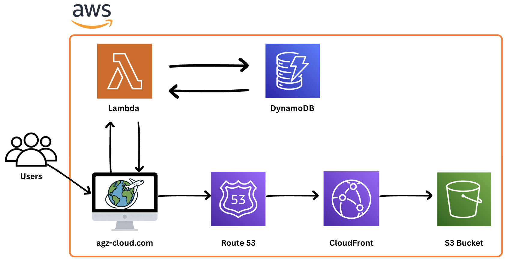

# Hi 👋

Welcome to my Cloud Hosted Resume project.

The goal was to go beyond simply hosting a static site and instead design a secure, scalable cloud architecture using Infrastructure as Code and CI/CD automation.

---

# About My Cloud Hosted Resume:

- This resume website is fully hosted on AWS using a secure and scalable serverless architecture!

- The frontend is stored in Amazon S3 and distributed globally using CloudFront with HTTPS enabled via AWS Certificate Manager. 

- DNS is managed through Route 53.

- The backend includes an AWS Lambda function connected to DynamoDB to power a dynamic visitor counter.

- All frontend deployments are automated using GitHub Actions for continuous integration and delivery.

**Terraform was used to provision core backend infrastructure components including:**
- The S3 bucket
- The Lambda function
- The DynamoDB table

---

# Here's A Diagram Of It:

---

# AWS Services Used:

- Amazon S3  
- CloudFront  
- Route 53  
- AWS Certificate Manager  
- AWS Lambda  
- DynamoDB  
- Terraform  
- GitHub Actions  